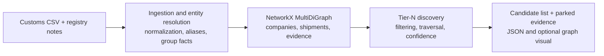
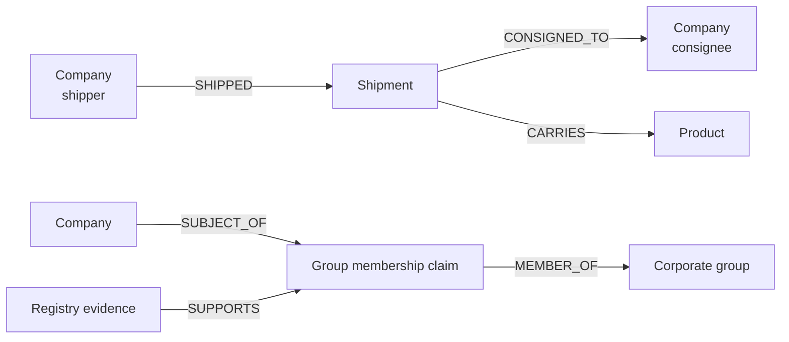

# Tier-N Discovery Architecture

This prototype treats customs manifests as evidence of a potential upstream supply relationship. It uses a Python `NetworkX.MultiDiGraph` so multiple shipment records, typed nodes, typed edges, and cycles are preserved.



## Evidence graph shape



## Trade-offs

A heterogeneous graph makes the problem's different kinds of things explicit: a company, shipment, product, corporate group, group-membership claim, and supporting registry evidence are different node types. It also makes upstream traversal, alternate paths, and circular references natural. A relational database is simpler for tabular ingestion and reporting, but recursive supply-chain queries require repeated joins and relationship provenance becomes spread across several tables. For this small prototype, the graph is easier to reason about; a production system could still store the source data relationally and build a graph projection for discovery.

Exact normalization and documented aliases are safer than broad fuzzy matching, because similar names can be unrelated. The cost is lower recall for genuine spelling variants. A configurable fuzzy threshold recovers some of those cases, but ambiguous matches must remain separate companies and be flagged for review rather than automatically merged.

Keeping individual Shipment nodes preserves the bill of lading, product, and data-quality evidence behind every candidate. It makes the internal graph richer but the visual graph denser. The displayed view should therefore aggregate shipments into one company-to-company supply edge while retaining the underlying BOL IDs.

Parking intra-group, freight, logistics, and generic packaging records reduces obvious false-positive suppliers. The cost is that a real supplier could be parked when its description is too generic. Retaining parked records with their exclusion reason keeps the decision reversible and auditable.

Confidence should fall as a path gets deeper because each shipment is only a signal of a relationship. This avoids presenting a Tier 5 inference as equally reliable as a direct Tier 2 signal, while still preserving lower-confidence paths for analyst review.

## Resolution and filtering rules

1. Normalize manifest names; retain their original spelling on Shipment nodes.
2. Resolve documented aliases before fuzzy matching. `Bergwerk Mining Alias GmbH` resolves to `Solstice Materials Europe GmbH`.
3. Fuzzy resolution is opt-in via `--entity-match-threshold` (default `0.94` normalized Levenshtein similarity), requires a `0.05` margin over the next candidate, and requires country agreement where both countries exist.
4. Do not infer corporate membership from a shared name token: `Solstice Analytics Inc` remains a separate company.
5. Park, rather than delete, confirmed intra-group and pass-through records so every exclusion remains explainable.

## Traversal and confidence

Solstice is Tier 1. For each shipment delivered to a company at Tier *n*, its shipper is a Tier *n + 1* candidate. The traversal records alternate paths and cycles but expands each company only once at its shallowest discovered tier.

### Relationship confidence

Score each accepted `supplier → buyer` relationship from `0` to `1`:

```text
relationship score = 0.30 × entity resolution
                   + 0.30 × material relevance
                   + 0.25 × repeated-shipment evidence
                   + 0.15 × data completeness
```

The four inputs are obtained as follows:

- **Entity resolution:** exact normalized names and documented aliases score `1.00`. A guarded fuzzy match uses its normalized Levenshtein similarity; an unresolved company scores `0.60`.
- **Material relevance:** classify `product_description` with explainable keyword rules, not an LLM for this prototype. Specific materials or chemicals score `1.00`; unclear descriptions score `0.50`; freight, logistics, and packaging are parked.
- **Repeated-shipment evidence:** count distinct, deduplicated BOL IDs for the canonical supplier/buyer pair. One, two, and three-or-more BOLs score `0.60`, `0.80`, and `1.00`.
- **Data completeness:** rows missing shipper, consignee, date, or product are parked as invalid. Missing country reduces completeness by `0.10`; missing weight by `0.05`. Vessel name does not affect the score.

For fuzzy matching, require the configured similarity threshold, a `0.05` margin over the next-best name, and equal countries when both are known. This prevents a shared token such as `Solstice` from merging unrelated companies.

For a Tier-N candidate, multiply the relationship scores along its path and apply a `0.90` penalty for every hop after Tier 2:

```text
path score = product(relationship scores) × 0.90^(number of relationships - 1)
```

Use the strongest discovered path as the candidate's displayed score. Label scores as High (`>= 0.75`), Medium (`>= 0.45`), or Low. Only High and Medium candidates are buyer-facing by default; Low-confidence candidates, parked records, and cycles remain available for analyst review.
