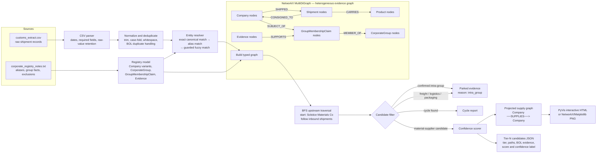

# Tier-N Discovery Architecture

This prototype treats customs manifests as evidence of a potential upstream supply relationship. It uses a Python `NetworkX.MultiDiGraph` so multiple shipment records, typed nodes, typed edges, and cycles are preserved.



## Resolution and filtering rules

1. Normalize manifest names; retain their original spelling on Shipment nodes.
2. Resolve documented aliases before fuzzy matching. `Bergwerk Mining Alias GmbH` resolves to `Solstice Materials Europe GmbH`.
3. Fuzzy resolution is opt-in via `--entity-match-threshold` (default `0.94` normalized Levenshtein similarity), requires a `0.05` margin over the next candidate, and requires country agreement where both countries exist.
4. Do not infer corporate membership from a shared name token: `Solstice Analytics Inc` remains a separate company.
5. Park, rather than delete, confirmed intra-group and pass-through records so every exclusion remains explainable.

## Traversal and confidence

Solstice is Tier 1. For each shipment delivered to a company at Tier *n*, its shipper is a Tier *n + 1* candidate. The traversal records alternate paths and cycles but expands each company only once at its shallowest discovered tier.

```text
edge score = resolution × material relevance × shipment evidence × completeness
path score = product(edge scores) × 0.90^(number of shipment edges - 1)
```

Only High and Medium confidence candidates are buyer-facing by default. Low-confidence candidates, parked records, and cycles remain available for analyst review.
