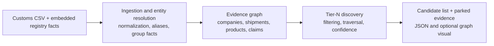
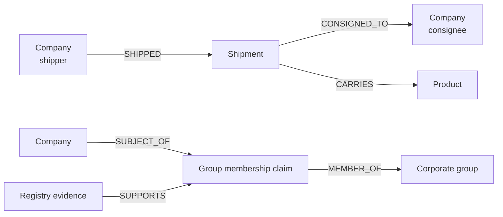

# Tier-N Discovery Architecture

## 1. Purpose and scope

This prototype identifies potential upstream suppliers from customs manifests. It treats each manifest as evidence of a possible supply relationship—not as proof—and preserves the evidence behind every result so analysts can review how a candidate was discovered.

The system uses a Python `NetworkX.MultiDiGraph`. This graph supports:

- multiple shipments between the same companies;
- distinct node and relationship types;
- alternate supply paths; and
- circular relationships.

Solstice is the starting company and is defined as Tier 1. A company shipping to a Tier *n* company becomes a Tier *n + 1* candidate.

## 2. System overview

The system turns a customs CSV and embedded registry facts into a ranked, explainable list of upstream supplier candidates. The customs CSV is the only runtime input; the curated registry facts ship with the application.



At a high level, the pipeline:

1. ingests customs records and loads embedded registry facts;
2. normalizes and resolves company identities;
3. builds an evidence graph without discarding source-level detail;
4. parks records that are invalid or unsuitable for supplier discovery;
5. traverses accepted shipment relationships upstream; and
6. ranks candidates by the strength of their best discovered path.

## 3. Evidence graph

The graph separates business entities from the evidence connecting them. Companies, shipments, products, corporate groups, membership claims, and registry evidence are represented as different node types.



Each Shipment node retains the original manifest name, bill of lading (BOL) ID, product description, and available data-quality fields. Keeping individual shipments makes every inferred relationship traceable to its source records.

For display, shipment nodes can be aggregated into a single `supplier → buyer` relationship to keep the visual graph readable. The underlying BOL IDs remain attached as supporting evidence.

## 4. Processing pipeline

### 4.1 Ingest and validate records

Rows missing a shipper, consignee, shipment date, or product description are invalid for discovery. The system parks these rows with an explanation instead of deleting them.

Valid records proceed to company resolution and product classification.

### 4.2 Resolve company identities

Resolution follows the safest available method, in this order:

1. Normalize manifest names while retaining their original spelling on Shipment nodes.
2. Apply documented aliases. For example, `Bergwerk Mining Alias GmbH` resolves to `Solstice Materials Europe GmbH`.
3. If explicitly enabled, attempt guarded fuzzy matching.
4. Keep ambiguous matches as separate companies and flag them for review.

Fuzzy matching is opt-in through `--entity-match-threshold`. Its default threshold is `0.94` normalized Levenshtein similarity. A match is accepted only when:

- it meets the configured similarity threshold;
- it exceeds the next-best candidate by at least `0.05`; and
- the countries agree when both records provide a country.

A shared name token is not evidence of corporate membership. For example, `Solstice Analytics Inc` remains separate from the Solstice corporate group unless registry evidence establishes a connection.

### 4.3 Classify and filter shipment evidence

The prototype classifies `product_description` using explainable keyword rules rather than an LLM.

- Specific materials and chemicals are relevant supplier evidence.
- Unclear descriptions remain usable but receive a lower relevance score.
- Freight, logistics, and generic packaging records are parked.
- Confirmed intra-group and pass-through shipments are also parked.

Parking is reversible: the record remains available with its exclusion reason for audit and analyst review.

### 4.4 Build supplier relationships

Each accepted shipment contributes evidence to a directed relationship from the shipper to the consignee:

```text
supplier → buyer
```

Distinct BOL IDs for the same canonical supplier/buyer pair are deduplicated and counted as repeated-shipment evidence.

### 4.5 Traverse upstream

Starting from Solstice at Tier 1, the traversal follows incoming supply relationships:

```text
shipment delivered to a Tier n company
                 ↓
shipper becomes a Tier n + 1 candidate
```

The traversal preserves alternate paths and cycles, but expands each company only once, at its shallowest discovered tier. This prevents repeated expansion while retaining evidence that the same company can be reached in more than one way.

## 5. Confidence model

Confidence is calculated in two stages: first for each direct supplier relationship, then for each complete path to a Tier-N candidate.

### 5.1 Relationship confidence

Each accepted `supplier → buyer` relationship receives a score from `0` to `1`:

```text
relationship score = 0.30 × entity resolution
                   + 0.30 × material relevance
                   + 0.25 × repeated-shipment evidence
                   + 0.15 × data completeness
```

The inputs are scored as follows:

| Input | Scoring rule |
| --- | --- |
| Entity resolution | Exact normalized names and documented aliases score `1.00`. A guarded fuzzy match uses its normalized Levenshtein similarity. An unresolved company scores `0.60`. |
| Material relevance | Specific materials or chemicals score `1.00`. Unclear descriptions score `0.50`. Freight, logistics, and packaging records are parked. |
| Repeated-shipment evidence | One distinct BOL scores `0.60`, two score `0.80`, and three or more score `1.00`. |
| Data completeness | Missing country reduces the score by `0.10`; missing weight reduces it by `0.05`. Vessel name does not affect the score. Records missing required fields were already parked during validation. |

### 5.2 Path confidence

A candidate's path score multiplies the relationship scores along the path and applies a depth penalty:

```text
path score = product(relationship scores) × 0.90^(number of relationships - 1)
```

The `0.90` factor penalizes every hop after Tier 2. Confidence therefore decreases as the inference moves farther from a direct relationship.

When a candidate has multiple paths, the system displays the strongest path score. It retains the other paths as supporting evidence.

Scores are labeled:

- **High:** `>= 0.75`
- **Medium:** `>= 0.45` and `< 0.75`
- **Low:** `< 0.45`

High- and Medium-confidence candidates are buyer-facing by default. Low-confidence candidates remain available for analyst review.

## 6. Outputs and explainability

The output is a ranked list of Tier-N supplier candidates. For each candidate, it provides:

- canonical company name and tier;
- strongest path to Solstice;
- confidence for each supplier relationship in the path;
- overall path-confidence score and High, Medium, or Low label; and
- supporting shipment, BOL, and product evidence.

Alternate paths and cycles are retained. Parked records remain available to analysts with their exclusion reasons.

Run the supplied dataset with:

```bash
uv run tier-n-discovery \
  --customs customs_extract.csv \
  --root "Solstice Materials Co" \
  --entity-match-threshold 0.94 \
  --output-dir output
```

The command writes these five artifacts under `output/`:

- `tier_n_candidates.json`
- `tier_n_candidates.csv` — candidate company, tier depth, and confidence
- `parked_shipments.json`
- `cycles.json`
- `tier_n_graph.html`

## 7. Before shipping

The prototype should be evaluated against manually reviewed examples before anyone relies on its candidate list. An LLM can reduce the review workload, but it should not define the expected answers: customs data is ambiguous, and using the same kind of model to create and judge labels can hide systematic errors.

### Build a reference dataset

Create a small but representative **golden dataset** from real or safely anonymized manifests. It should include:

- direct and multi-tier supplier relationships;
- repeated shipments and duplicate BOL records;
- spelling variations, documented aliases, and ambiguous company names;
- related companies with similar names that must remain separate;
- intra-group and pass-through shipments;
- freight, logistics, packaging, unclear, and clearly relevant materials;
- missing optional and required fields; and
- alternate paths and cycles.

For each record, a reviewer should label the expected canonical companies, material category, accept-or-park decision, exclusion reason, supplier relationship, and Tier-N candidate path. A second reviewer should resolve uncertain or disputed cases.

An LLM can prepare a first-pass annotation by suggesting company matches, extracting likely materials, and explaining why a record may be relevant or should be parked. Reviewers must confirm or correct every suggestion. Store the final human decision and the LLM suggestion separately so model assistance does not become invisible ground truth.

### Run the evaluation

Use two non-overlapping samples:

1. A development set for refining normalization, aliases, keyword rules, and confidence weights.
2. A held-out set that is evaluated only after those rules are fixed.

Run the pipeline on both sets and compare its output with the human labels. Review at least:

| Area | What to measure |
| --- | --- |
| Entity resolution | Correct merges, missed aliases, and false merges—especially among similarly named companies. |
| Material classification | Precision and recall for relevant materials, plus the quality of unclear classifications. |
| Filtering | Correctly parked records, incorrectly parked suppliers, and the accuracy of exclusion reasons. |
| Supplier relationships | Precision and recall for accepted `supplier → buyer` relationships. |
| Tier-N discovery | Candidate precision and recall by tier, including correct shallowest-tier assignment. |
| Confidence | Whether High, Medium, and Low labels correspond to observed correctness. |
| Explainability | Whether an analyst can reproduce each result from its path, BOLs, and recorded decisions. |

All false merges and high-confidence false positives should receive manual investigation because they can contaminate many downstream paths. Also inspect a random sample of correct-looking results; aggregate metrics alone can miss plausible but unsupported relationships.

Before release, agree on acceptance thresholds for the metrics above, run the held-out evaluation once, and document the results. Then conduct a shadow run in which analysts use the tool on unseen data without exposing its results to buyers. Ship only after the review confirms that the output is useful, exclusions are recoverable, and the evidence trail is sufficient to challenge a result.

## 8. Next version

The next version should retain the current evidence-first design while replacing prototype shortcuts with services that support durable data, repeatable extraction, and analyst feedback.

### Extract materials with an LLM

Replace keyword-only classification with schema-constrained LLM extraction. For each product description, the extractor should return:

- the normalized material or product;
- a material category;
- whether it is likely relevant to the buyer's supply chain;
- a confidence score;
- the exact source text supporting the extraction; and
- a review reason when the result is uncertain.

Keep the original description alongside every extraction. Version the prompt, model, schema, and result so classifications can be reproduced and reprocessed. Route low-confidence outputs, novel materials, and disagreements with deterministic rules to a human review queue. Continue evaluating the extractor against human-labeled data rather than treating model confidence as correctness.

### Store the graph durably

Move the in-memory `NetworkX` graph to a persistent graph database. Neo4j is a practical first option because its property-graph model maps directly to the prototype's typed nodes, relationships, and provenance, and Cypher supports variable-length upstream traversal. A managed Neo4j service can provide backups and operational ownership; alternatives such as Amazon Neptune may be preferable when the deployment already depends on AWS governance and infrastructure.

The persistent model should store:

- canonical companies and their aliases;
- shipments and deduplicated BOL identifiers;
- products and LLM material extractions;
- corporate groups, membership claims, and supporting evidence;
- accepted and parked decisions with reasons;
- relationship and path-confidence inputs; and
- analyst reviews, overrides, and processing-version metadata.

Use stable identifiers and idempotent writes so new manifests can be ingested incrementally without duplicating existing evidence. Keep the graph as the discovery and provenance layer; raw source files can remain in object storage, with immutable references from graph evidence nodes.

### Operationalize the workflow

After material extraction and graph persistence, add:

1. an analyst queue for ambiguous entity matches, uncertain materials, and high-impact exclusions;
2. incremental ingestion with validation, retries, and dead-letter handling;
3. access controls for source records and analyst decisions;
4. monitoring for extraction drift, entity-resolution errors, and confidence calibration; and
5. scheduled reprocessing when aliases, prompts, models, or scoring rules change.

These additions preserve the prototype's core contract: every candidate remains traceable to source evidence, and every automated decision remains reviewable and reversible.

## 9. Architectural trade-offs

### Graph model versus relational storage

A heterogeneous graph makes different concepts and relationships explicit, and naturally supports upstream traversal, alternate paths, and cycles. A relational database is simpler for tabular ingestion and reporting, but recursive queries require repeated joins and relationship provenance becomes distributed across several tables.

For this prototype, a graph is easier to reason about. A production system could retain relational source storage and build a graph projection for discovery.

### Conservative versus fuzzy entity resolution

Exact normalization and documented aliases reduce the risk of merging unrelated companies, but they miss genuine spelling variants. Optional guarded fuzzy matching improves recall while requiring ambiguous cases to remain separate and reviewable.

### Shipment detail versus graph readability

Individual Shipment nodes preserve source evidence but create a denser graph. Aggregating them only in the displayed view keeps the visualization legible without losing the underlying shipment and BOL data.

### Filtering versus recall

Parking intra-group, freight, logistics, and generic packaging records reduces obvious false positives. A genuine supplier can still be parked when its description is too generic, so exclusions remain reversible and visible to analysts.

### Depth versus confidence

Every shipment is only a signal of a supply relationship. Applying a depth penalty avoids presenting a Tier 5 inference as equally reliable as a direct Tier 2 signal while preserving deeper paths for investigation.
